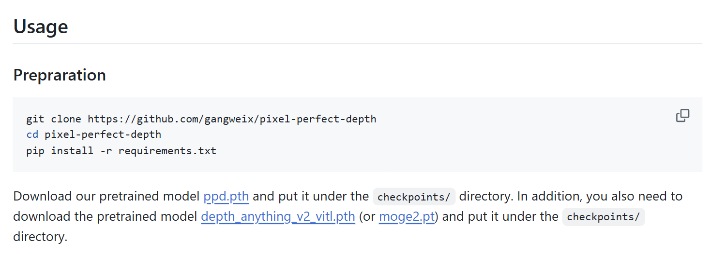

# 3D 浮雕定制（本地预览版）

一个基于 Vite + React + Three.js（@react-three/fiber）的实验项目，用于在本地预览 3D 浮雕手机壳的交互效果。

## 本地运行
- 请保证设备下载了[Node.js](https://nodejs.org/zh-tw/download/current)与[git](https://git-scm.com/install/)
- 进入项目目录
  - Windows PowerShell：
    ```bash
    cd "c:\Users\king3\Desktop\拓竹"
    ```
  - 如果你的项目路径不同，请改为你的实际路径。
- 安装依赖
  ```bash
  npm install
  ```
- 启动开发服务器
  ```bash
  npm run dev
  ```
  - 默认本地地址通常为：http://localhost:5173
  - 终端关闭或按 Ctrl + C 将停止服务。

## 网站使用说明

1. 操作流程：选择手机型号-》上传图片或AI生成-》生成浮雕-》调整参数-》导出stl文件
2. 注意事项
   - 手机型号选择目前仅支持 iPhone 16，后续会添加其他型号。
   - 若未上传图片或 AI 生成图片，默认使用 public 文件夹中的 test-depth.jpg。
   -最好按照操作流程来，不然我也不知道会有什么bug。
3. 左侧面板可调整浮雕的高度、大小、旋转角度。右侧视图用鼠标拖动可改变观察角度；点击右上角“调整位置”会强制进入俯视状态，此时拖动鼠标可以移动浮雕。浮雕可移动到手机壳外，外部部分在调整状态下显示为红色；在非调整状态下越界部分不可见。在调整状态下可以选择擦除删掉不需要的浮雕，但目前功能不太稳定，建议先别用，等后续优化。点击“完成调整”返回。
4. 本地在生成深度图时会把图片先放入backend/uploads文件夹，然后再生成深度图，生成的深度图可以在backend/outputs文件夹中找到。

## 项目文件说明

- 根目录
  - index.html：Vite 入口 HTML。
  - package.json：依赖与脚本（dev/build/preview）。
  - vite.config.js：Vite 配置。
  - tailwind.config.js：Tailwind CSS 配置。
  - postcss.config.js：PostCSS 配置。
  - README.md：项目说明（当前文件）。
  - 新建 XLSX 工作表.xlsx：临时文件，与项目无关。
- public
  - test-depth.jpg：用于生成浮雕的深度贴图（灰度图）。
  - .gitkeep：保持目录存在的占位文件。
- src
  - main.jsx：React 应用入口。
  - App.jsx：页面主框架与状态管理，组合左侧参数区与右侧 3D 预览。
  - index.css：全局样式与 Tailwind 引入。
  - components/
    - Scene3D.jsx：3D 场景核心，包含手机壳占位体、浮雕网格、相机与光照、交互逻辑（拖拽、越界提示）。
    - preview-panel.jsx：右侧预览区容器，承载 Scene3D 并接收上层状态。
    - emboss-parameters.jsx：左侧浮雕参数面板（高度、大小、旋转、生成按钮等）。
    - image-input-area.jsx：图片上传与 AI 相关入口（当前未实现逻辑，占位）。
    - phone-model-selector.jsx：手机型号选择入口（当前未实现逻辑，占位）。
    - ErrorBoundary.jsx：运行期错误边界，保护 3D 视图不崩溃。
    - ui/button.jsx：通用按钮组件。
    
    新增的深度图模型放在:
    ├─ backend/
    │ ├─ depth_service/ # FastAPI 后端服务
      │ ├─ pixel-perfect-depth/ # Pixel-Perfect-Depth 模型源码 + 请自己新建一个checkpoints文件夹放在这里面
      │ ├─ uploads/ # 临时上传图片缓存
      │ ├─ api.py/
      │ └─ outputs/ # 生成的深度图保存

## 后端服务说明

 一、后端 FastAPI 服务（Depth 生成）

 1.配置API文件
   新建.env文件，文件内容为ZHIPU_API_KEY="你的智谱API密钥"

 2.安装依赖

  ### 自动安装（推荐）
  运行自动安装脚本，会检测GPU并安装对应的依赖：
  ```bash
  python install_gpu_deps.py
  ```

  ### 手动安装
  ```bash
  cd backend/depth_service
  pip install -r requirements.txt
  如果没有requirements.txt，可以手动安装：
  pip install fastapi uvicorn pillow numpy opencv-python torch torchvision
  ```

 3.下载仓库为https://github.com/gangweix/pixel-perfect-depth，
  在他们的Readme里找到：
  按Usage-Preparation里的步骤下载好 ppd.pth和depth_anything_v2_vitl.pth模型权重并放到checkpoints文件夹
  形成目录backend/depth_service/pixel-perfect-depth/checkpoints/
     
 3.启动后端服务（8001 for 深度图生成，8000 for 智谱AI生图）
uvicorn backend.depth_service.api:app --port 8001 --reload
uvicorn main:app --port 8000 --reload
- `npm install`：安装依赖。
- `npm run dev`：启动开发服务器进行本地预览。
- `npm run build`：打包生成静态文件（dist）。
- `npm run preview`：本地预览打包产物。
